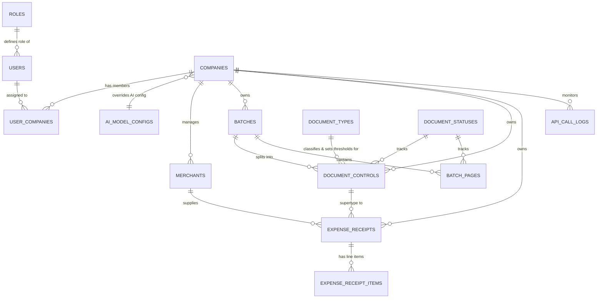

# 🏛️ Database Schema Reference (`storage/database/pipeline.db`)

เอกสารอ้างอิงโครงสร้างฐานข้อมูลเชิงสัมพันธ์ระดับองค์กร (Canonical Entity-Relationship Reference) พัฒนาด้วย **Pure SQLAlchemy 2.0 ORM** รองรับ SQLite (Development/Edge) และ PostgreSQL/MySQL (Production/Cloud) พร้อมระบบ **Enterprise RBAC, Multi-Company Isolation, Data-Driven Super Admin Bypass, และ 4 Audit Columns (Clean State Pattern)**

---

## 🗺️ 1. Entity-Relationship (ER) Overview

---

## 📑 2. Table Dictionaries

### 2.1 `roles` (Master RBAC Roles & Capabilities)
| Column | Type | Nullable | Default | Description |
| :--- | :--- | :--- | :--- | :--- |
| `role_code` 🔑 | `VARCHAR(50)` | NO | PK | Role code (`ADMIN`, `SYSTEM`, `REVIEWER`, `VIEWER`) |
| `role_name` | `VARCHAR(100)` | NO | - | ชื่อบทบาทภาษาไทย (เช่น 'ผู้ดูแลระบบสูงสุด') |
| `description` | `TEXT` | YES | - | คำอธิบายสิทธิ์การใช้งาน |
| `is_admin` | `INTEGER` | NO | `0` | 🌟 1: Super Admin / Data-Driven Company Bypass, 0: Scoped |
| `is_system` | `INTEGER` | NO | `1` | 1: System-reserved role (ห้ามลบ/แก้ไขรหัส) |
| `created_at` | `VARCHAR(50)` | NO | UTC ISO | Creation timestamp |
| `created_by` | `VARCHAR(36)` | NO | `'usr_system_admin'` | System actor creating the role |

---

### 2.2 `users` (Global Identity & Authentication)
| Column | Type | Nullable | Default | Description |
| :--- | :--- | :--- | :--- | :--- |
| `user_id` 🔑 | `VARCHAR(36)` | NO | PK | Prefixed ID (e.g. `usr_system_admin`, `usr_system_auto`, `usr_demo`) |
| `email` | `VARCHAR(255)` | NO | Unique | Login email username |
| `full_name` | `VARCHAR(255)` | NO | - | Full name or system actor title |
| `password_hash` | `VARCHAR(255)` | YES | `NULL` | Bcrypt password hash (Future-Proof Auth readiness) |
| `role` 🌐 | `VARCHAR(50)` | NO | FK (`roles.role_code`) | RBAC Role assignment |
| `is_active` | `INTEGER` | NO | `1` | User active status (1: Active, 0: Suspended) |
| `created_at` | `VARCHAR(50)` | NO | UTC ISO | Registration timestamp |
| `created_by` | `VARCHAR(36)` | NO | `'usr_system_admin'` | Actor creating the user |
| `updated_at` | `VARCHAR(50)` | YES | `NULL` | Last modification timestamp (Clean State) |
| `updated_by` | `VARCHAR(36)` | YES | `NULL` | Last actor modifying the user (Clean State) |

---

### 2.3 `user_companies` (Multi-Company Tenant Mapping)
| Column | Type | Nullable | Default | Description |
| :--- | :--- | :--- | :--- | :--- |
| `id` 🔑 | `VARCHAR(36)` | NO | PK | Prefixed ID (e.g. `uc_4c1e19d110ab`) |
| `user_id` 🌐 | `VARCHAR(36)` | NO | FK (`users.user_id`, CASCADE) | Mapped user ID |
| `company_id` 🌐 | `VARCHAR(36)` | NO | FK (`companies.company_id`, CASCADE) | Mapped company ID |
| `is_default` | `INTEGER` | NO | `0` | 1: Default active company on login, 0: Secondary |
| `created_at` | `VARCHAR(50)` | NO | UTC ISO | Assignment timestamp |
| `created_by` | `VARCHAR(36)` | NO | `'usr_system_admin'` | Admin assigning the mapping |

*(มี Composite Unique Constraint `uq_user_company` บน `(user_id, company_id)` ป้องกันการ Assign ซ้ำ)*

---

### 2.4 `ai_model_configs` (Universal AI Provider & Pricing Configs)
| Column | Type | Nullable | Default | Description |
| :--- | :--- | :--- | :--- | :--- |
| `config_id` 🔑 | `VARCHAR(50)` | NO | PK | Configuration ID (e.g. `conf_default_provider_free`, `conf_default_provider_paid`) |
| `config_name` | `VARCHAR(100)` | NO | - | Display name (e.g. 'Gemini 3.5 Flash Lite (Free Tier)') |
| `provider` | `VARCHAR(50)` | NO | `'gemini'` | AI Provider (`gemini`, `openai`) |
| `model_name` | `VARCHAR(100)` | NO | - | Model identifier (`gemini-3.5-flash-lite`, `gemini-3.5-flash`) |
| `billing_tier` | `VARCHAR(20)` | NO | `'free'` | Billing tier (`free`, `paid`) |
| `api_key_env_var` | `VARCHAR(100)` | NO | - | Environment variable holding API key |
| `input_price_per_million` | `FLOAT` | NO | `0.0` | Input token price per 1M tokens (USD) |
| `output_price_per_million` | `FLOAT` | NO | `0.0` | Output token price per 1M tokens (USD) |
| `exchange_rate_thb` | `FLOAT` | NO | `36.0` | FX rate USD/THB for nominal cost |
| `max_concurrent_requests` | `INTEGER` | NO | `8` | Max concurrent worker requests |
| `is_default` | `INTEGER` | NO | `0` | 1: Global default AI config, 0: Secondary |
| `is_active` | `INTEGER` | NO | `1` | Config active flag |
| `created_at` | `VARCHAR(50)` | NO | UTC ISO | Creation timestamp |
| `created_by` | `VARCHAR(36)` | NO | `'usr_system_admin'` | Actor creating config |
| `updated_at` | `VARCHAR(50)` | YES | `NULL` | Last modification timestamp |
| `updated_by` | `VARCHAR(36)` | YES | `NULL` | Last actor modifying config |

---

### 2.5 `document_types` (Master Document Taxonomy, Strategy & Quality Thresholds)
| Column | Type | Nullable | Default | Description |
| :--- | :--- | :--- | :--- | :--- |
| `doc_type_id` 🔑 | `VARCHAR(50)` | NO | PK | Document type identifier (`expense_receipt`, `tax_invoice`, `withholding_tax`, etc.) |
| `display_name` | `VARCHAR(100)` | NO | - | ชื่อประเภทเอกสารภาษาไทย (เช่น 'ใบเสร็จรับเงินค่าใช้จ่าย') |
| `description` | `TEXT` | YES | - | คำอธิบายวัตถุประสงค์และขอบเขตของเอกสาร |
| `processing_type` | `VARCHAR(50)` | NO | `'AI'` | Strategy mode (`AI`: สกัดด้วย LLM, `ARCHIVE_ONLY`: จัดเก็บไฟล์เข้า Archive อย่างเดียว) |
| `sort_order` | `INTEGER` | NO | `1` | ลำดับการแสดงผลในหน้าจอ UI/Filter |
| `is_active` | `INTEGER` | NO | `1` | สถานะเปิดใช้งานประเภทเอกสาร (1: Active, 0: Disabled) |
| `confidence_high` | `FLOAT` | YES | `0.85` | เกณฑ์ความมั่นใจขั้นสูงสำหรับ Auto-Approve (Nullable สำหรับ non-AI) |
| `confidence_review` | `FLOAT` | YES | `0.70` | เกณฑ์ความมั่นใจขั้นต่ำก่อนส่งเข้า Manual Review |
| `confidence_low` | `FLOAT` | YES | `0.60` | เกณฑ์ความมั่นใจขั้นวิกฤต (Priority HIGH) |
| `financial_tolerance` | `FLOAT` | YES | `0.05` | ค่าความคลาดเคลื่อนทางคณิตศาสตร์ที่ยอมรับได้ (บาท, Nullable สำหรับเอกสารไม่เกี่ยวกับการเงิน) |
| `split_filename_pattern` | `VARCHAR(255)` | YES | - | ฟอร์แมตชื่อไฟล์สปลิตเฉพาะประเภทเอกสาร |
| `archive_filename_pattern` | `VARCHAR(255)` | YES | - | ฟอร์แมตชื่อไฟล์จัดเก็บถาวรเฉพาะประเภทเอกสาร |
| `dpi` | `INTEGER` | YES | `150` | ความละเอียดในการ Rasterize PDF ของเอกสารประเภทนี้ |
| `created_at` | `VARCHAR(50)` | NO | UTC ISO | Creation timestamp |
| `created_by` | `VARCHAR(36)` | NO | `'usr_system_admin'` | Actor creating record |
| `updated_at` | `VARCHAR(50)` | YES | `NULL` | Last modification timestamp |
| `updated_by` | `VARCHAR(36)` | YES | `NULL` | Last actor modifying record |

---

### 2.6 `companies` (Multi-Tenant Organization Aggregate)
| Column | Type | Nullable | Default | Description |
| :--- | :--- | :--- | :--- | :--- |
| `company_id` 🔑 | `VARCHAR(36)` | NO | PK | Prefixed ID (e.g. `comp_b53314b28a42`) |
| `company_code` | `VARCHAR(50)` | NO | Unique | Unique identifier code (e.g. `C00000_SAMPLE`) |
| `company_name` | `VARCHAR(255)` | NO | - | Legal registered company name |
| `short_name` | `VARCHAR(50)` | NO | - | Short mnemonic name |
| `tax_id` | `VARCHAR(13)` | YES | Unique | 13-digit Juristic/Company Tax ID |
| `branch_code` | `VARCHAR(5)` | NO | `'00000'` | Head office (`00000`) or Branch code |
| `ai_config_id` 🌐 | `VARCHAR(50)` | YES | FK (`ai_model_configs.config_id`) | Dedicated AI Model/Tier override for company |
| `is_active` | `INTEGER` | NO | `1` | Tenant activation flag (1: Active, 0: Suspended) |
| `created_at` | `VARCHAR(50)` | NO | UTC ISO | Creation timestamp |
| `created_by` | `VARCHAR(36)` | NO | `'usr_system_admin'` | Actor creating tenant |
| `updated_at` | `VARCHAR(50)` | YES | `NULL` | Last modification timestamp |
| `updated_by` | `VARCHAR(36)` | YES | `NULL` | Last actor modifying tenant |

---

### 2.5 `merchants` (Canonical Vendor Master & Gatekeeper)
| Column | Type | Nullable | Default | Description |
| :--- | :--- | :--- | :--- | :--- |
| `merchant_id` 🔑 | `VARCHAR(100)` | NO | PK | Prefixed ID (e.g. `merch_99a81e320f11`, `NO_TAX_ID`) |
| `company_id` 🌐 | `VARCHAR(36)` | YES | FK (`companies.company_id`) | Tenant scope isolation |
| `tax_id` | `VARCHAR(50)` | YES | - | 13-digit Juristic Tax ID of Vendor |
| `merchant_name` | `VARCHAR(200)` | NO | - | Formal registered business name |
| `short_name` | `VARCHAR(100)` | NO | `'merchant'` | Sanitized identifier (e.g. `7eleven`, `cpall`) |
| `file_prefix` | `VARCHAR(100)` | NO | `'merchant'` | Zero-cost fast-match prefix |
| `status_code` | `VARCHAR(50)` | NO | `'APPROVED'` | Gatekeeper status (`APPROVED`, `PENDING`, `IGNORED`) |
| `approved_by` | `VARCHAR(100)` | YES | - | User approving this vendor |
| `approved_at` | `VARCHAR(50)` | YES | - | Approval UTC timestamp |
| `default_wht_rate` | `FLOAT` | NO | `0.0` | Default Withholding Tax Rate (%) |
| `is_vat_registered` | `INTEGER` | NO | `1` | 1: VAT Registered (7%), 0: Non-VAT |
| `is_override_vat` | `INTEGER` | NO | `1` | 1: Manual VAT Override (ยึดตามหน้าบิล), 0: Auto 7% |
| `is_active` | `INTEGER` | NO | `1` | Master data active switch |
| `created_at` | `VARCHAR(50)` | NO | UTC ISO | Discovery/Creation timestamp |
| `created_by` | `VARCHAR(36)` | NO | `'usr_system_admin'` | Creator actor ID |
| `updated_at` | `VARCHAR(50)` | YES | `NULL` | Modification timestamp |
| `updated_by` | `VARCHAR(36)` | YES | `NULL` | Modifier actor ID |

---

### 2.6 `batches` (Raw Ingestion Batch Tracker)
| Column | Type | Nullable | Default | Description |
| :--- | :--- | :--- | :--- | :--- |
| `batch_id` 🔑 | `VARCHAR(100)` | NO | PK | Prefixed ID (e.g. `batch_123`) |
| `company_id` 🌐 | `VARCHAR(36)` | YES | FK (`companies.company_id`) | Tenant scope |
| `original_filename` | `VARCHAR(255)` | NO | - | Original uploaded PDF or multi-page file name |
| `total_pages` | `INTEGER` | NO | `1` | Total page count |
| `storage_path` | `VARCHAR(500)` | NO | - | Relative path to raw archive storage |
| `file_hash` | `VARCHAR(64)` | NO | Unique | SHA-256 content digest preventing duplicate processing |
| `created_at` | `VARCHAR(50)` | NO | UTC ISO | Ingestion timestamp |
| `created_by` | `VARCHAR(36)` | NO | `'usr_system_auto'` | Ingesting actor ID |
| `updated_at` | `VARCHAR(50)` | YES | `NULL` | Modification timestamp |
| `updated_by` | `VARCHAR(36)` | YES | `NULL` | Modifier actor ID |

---

### 2.7 `batch_pages` (Physical Page Image & Smart Chunk Checkpoint)
| Column | Type | Nullable | Default | Description |
| :--- | :--- | :--- | :--- | :--- |
| `page_id` 🔑 | `VARCHAR(100)` | NO | PK | Prefixed ID (e.g. `page_4c1e19d110ab`) |
| `batch_id` 🌐 | `VARCHAR(100)` | NO | FK (`batches.batch_id`) | Parent batch ID |
| `document_id` 🌐 | `VARCHAR(100)` | YES | FK (`document_controls.document_id`) | Associated logical document |
| `page_number` | `INTEGER` | NO | - | 1-based physical page index |
| `chunk_index` | `INTEGER` | NO | `1` | AI extraction chunk sequence for smart checkpoint/resuming |
| `image_path` | `VARCHAR(500)` | NO | - | Relative disk path to preprocessed JPG image |
| `status_code` 🌐 | `VARCHAR(50)` | NO | FK (`document_statuses.status_code`) | Page status (`PREPROCESSED`, `EXTRACTED`, `FAILED`) |
| `error_reason` | `TEXT` | YES | - | Chunk extraction failure reason for targeted retry |
| `created_at` | `VARCHAR(50)` | NO | UTC ISO | Ingestion timestamp |

---

### 2.8 `document_controls` (Central Universal Supertype & Concurrency Lease)
| Column | Type | Nullable | Default | Description |
| :--- | :--- | :--- | :--- | :--- |
| `document_id` 🔑 | `VARCHAR(100)` | NO | PK | Prefixed ID (e.g. `doc_c4e5a5799901`) |
| `company_id` 🌐 | `VARCHAR(36)` | YES | FK (`companies.company_id`) | Tenant scope |
| `batch_id` 🌐 | `VARCHAR(100)` | NO | FK (`batches.batch_id`) | Parent batch |
| `doc_type_id` 🌐 | `VARCHAR(50)` | NO | FK (`document_types.doc_type_id`) | Document taxonomy classification type & thresholds |
| `status_code` 🌐 | `VARCHAR(50)` | NO | FK (`document_statuses.status_code`) | Workflow status (`PENDING`, `PROCESSED`, `APPROVED`, etc.) |
| `search_text` | `TEXT` | YES | - | Full-text search index string |
| `data_payload` | `TEXT` | YES | - | Normalized raw JSON payload |
| `error_reason` | `TEXT` | YES | - | Error stack or validation failure note |
| `is_closed` | `INTEGER` | NO | `0` | Atomic seal against post-approval modifications |
| `is_locked` | `INTEGER` | NO | `0` | Concurrency lock flag |
| `locked_by` | `VARCHAR(36)` | YES | - | User holding the lease |
| `locked_at` | `VARCHAR(50)` | YES | - | Lease grant timestamp (UTC) |
| `is_manually_edited`| `INTEGER` | NO | `0` | 1: Modified by human reviewer |
| `confirmed_by` | `VARCHAR(100)` | YES | - | Reviewer approving payload |
| `confirmed_at` | `VARCHAR(50)` | YES | - | Approval timestamp |
| `model_used` | `VARCHAR(100)` | YES | - | AI Model used for extraction |
| `cost_usd` | `FLOAT` | NO | `0.0` | Real AI extraction cost in USD |
| `cost_thb` | `FLOAT` | NO | `0.0` | Converted AI extraction cost in THB |
| `is_free_tier` | `INTEGER` | NO | `0` | Free tier cost bypass indicator |
| `overall_confidence`| `FLOAT` | YES | - | Composite confidence score (0.00 - 1.00) |
| `confidence_level` | `VARCHAR(50)`| YES | - | Categorical rating (`HIGH`, `MEDIUM`, `LOW`) |
| `is_blurry` | `INTEGER` | YES | - | Visual quality indicator |
| `is_ambiguous` | `INTEGER` | YES | - | Ambiguity indicator |
| `confidence_notes` | `TEXT` | YES | - | Explanation of low confidence fields |
| `review_priority` | `VARCHAR(20)`| YES | - | Review routing urgency (`URGENT`, `HIGH`, `LOW`) |
| `created_at` | `VARCHAR(50)` | NO | UTC ISO | Creation timestamp |
| `created_by` | `VARCHAR(36)` | NO | `'usr_system_auto'` | Processing actor ID |
| `updated_at` | `VARCHAR(50)` | YES | `NULL` | Last modification timestamp |
| `updated_by` | `VARCHAR(36)` | YES | `NULL` | Last modifier actor ID |

---

### 2.9 `expense_receipts` & `expense_receipt_items` (Financial Domain Breakdown)
- **`expense_receipts`**: Subtype Header record storing `receipt_id`, `company_id`, `document_id`, `merchant_id`, `doc_number`, `transaction_date`, `merchant_name`, `tax_id`, `expense_category`, `subtotal`, `discount_amount`, `vat_amount`, `net_amount`, `payment_method`, `created_by`, `updated_by`, etc.
- **`expense_receipt_items`**: Detail line items storing `item_id`, `receipt_id`, `item_name`, `quantity`, `unit_price`, `total_price`.

---

### 2.10 `api_call_logs` (AI Observability & Cost Telemetry)
| Column | Type | Nullable | Default | Description |
| :--- | :--- | :--- | :--- | :--- |
| `log_id` 🔑 | `VARCHAR(100)` | NO | PK | Telemetry call log ID |
| `company_id` 🌐 | `VARCHAR(36)` | YES | FK (`companies.company_id`) | Multi-tenant billing attribution |
| `batch_id` | `VARCHAR(100)` | YES | - | Associated batch ID |
| `provider` | `VARCHAR(50)` | NO | - | AI Provider (`gemini`, `openai`) |
| `model_name` | `VARCHAR(100)` | NO | - | Exact model version |
| `chunk_index` | `INTEGER` | YES | - | Chunk segment index |
| `request_pages` | `TEXT` | YES | - | Pages sent in payload |
| `status_code` | `VARCHAR(50)` | NO | - | Outcome (`SUCCESS`, `FAILED`) |
| `input_tokens` | `INTEGER` | NO | `0` | Prompt input token count |
| `output_tokens` | `INTEGER` | NO | `0` | Response token count |
| `cost_usd` | `FLOAT` | NO | `0.0` | Incurred cost (USD) |
| `nominal_value_usd`| `FLOAT` | NO | `0.0` | Commercial value before free-tier rebate |
| `is_free_tier` | `INTEGER` | NO | `0` | Free tier flag |
| `latency_ms` | `FLOAT` | YES | - | Network and model latency in milliseconds |
| `error_reason` | `TEXT` | YES | - | Error stack trace if failed |
| `created_at` | `VARCHAR(50)` | NO | UTC ISO | Execution timestamp |

---

### 2.11 `target_systems` & `integration_methods` (Destination ERP Registry)
- **`integration_methods`**: `method_id` (`RPA_UIPATH`, `REST_API`, `WEBHOOK`, `CSV_EXPORT`, `EXCEL_EXPORT`, `DIRECT_DB`), `method_name`, `description`.
- **`target_systems`**: `system_id` (`EXPRESS`, `SAP`, `PEAK`, `HR_PORTAL`, `GENERIC_CSV`), `system_name`, `system_category`, `integration_method_id`, `description`.

---

### 2.12 `expense_account_mappings` & `expense_types` (GL Mapping & WHT Rules)
- **`expense_types`**: `expense_type_id`, `expense_type_name` (`ค่าบริการ`, `ค่าขนส่ง`), `default_wht_rate` (`3.0`, `1.0`), `wht_income_type`.
- **`expense_account_mappings`**: `mapping_id`, `company_id`, `target_system_id`, `expense_type_name`, `account_code` (`95-5310-19`, `95-5200-05`), `account_name`, `department_code`. (Unique constraint on `company_id + target_system_id + expense_type_name`).

---

### 2.13 `journal_vouchers` & `journal_vouchers_items` (Canonical ERP Export Headers & Lines)
- **`journal_vouchers`**:
  - `voucher_id` 🔑 (`vch_...`) PK
  - `document_id` 🌐 Unique FK to `document_controls`
  - `company_id` 🌐, `batch_id` 🌐, `target_system_id` 🌐
  - `voucher_type` (default `'OE'`), `voucher_no` (`OE260730001`), `voucher_date` (ISO `YYYY-MM-DD`)
  - `vendor_code` (`G0001`, `อ0022`, `S0002`), `vendor_name`, `vendor_tax_id`, `vendor_branch_code`
  - `ref_doc_no`, `ref_doc_date`
  - `subtotal_amount`, `vat_type` (`EXCLUSIVE`, `INCLUSIVE`, `NO_VAT`), `vat_rate`, `vat_amount`, `is_override_vat` (1: Manual VAT from bill), `wht_amount`, `net_amount`
  - `target_payload` (Serialized destination JSON for RPA bot)
  - `status_code` (`DRAFT`, `READY`, `POSING`, `POSTED`, `ERROR`, `CANCELLED`)
  - `is_locked`, `locked_by`, `locked_at`, `erp_reference_no`, `posted_at`, `rpa_error_reason`
- **`journal_vouchers_items`**:
  - `item_id` 🔑 (`vchi_...`) PK
  - `voucher_id` 🌐 FK to `journal_vouchers`
  - `line_number`, `entry_type` (`DEBIT`/`CREDIT`), `account_code`, `account_name`, `department_code`, `amount`, `description`
