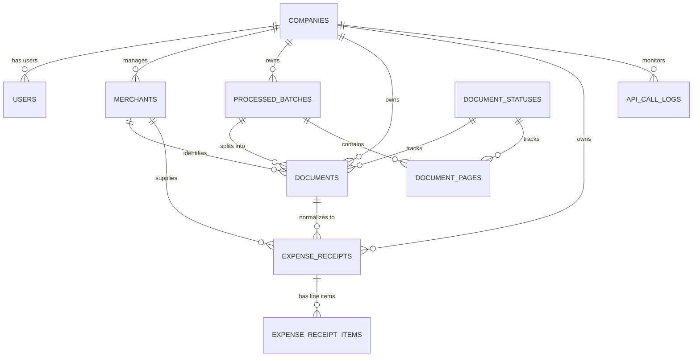

# 🏛️ Database Schema Reference (`storage/database/pipeline.db`)

เอกสารอ้างอิงโครงสร้างฐานข้อมูลเชิงสัมพันธ์ระดับองค์กร (Canonical Entity-Relationship Reference) พัฒนาด้วย **Pure SQLAlchemy 2.0 ORM** รองรับ SQLite (Development/Edge) และ PostgreSQL/MySQL (Production/Cloud)

---

## 🗺️ 1. Entity-Relationship (ER) Overview

---

## 📑 2. Table Dictionaries

### 2.1 `companies` (Multi-Tenant Organization Aggregate)
| Column | Type | Nullable | Default | Description |
| :--- | :--- | :--- | :--- | :--- |
| `company_id` 🔑 | `VARCHAR(36)` | NO | PK | Prefixed ID (e.g. `comp_b53314b28a42`) |
| `company_code` | `VARCHAR(50)` | NO | Unique | Unique identifier code (e.g. `C00000_SAMPLE`) |
| `company_name` | `VARCHAR(200)` | NO | - | Legal registered company name |
| `tax_id` | `VARCHAR(20)` | NO | Unique | 13-digit Juristic/Company Tax ID |
| `branch_code` | `VARCHAR(10)` | NO | `'00000'` | Head office (`00000`) or Branch code |
| `is_active` | `INTEGER` | NO | `1` | Tenant activation flag (1: Active, 0: Suspended) |
| `created_at` | `VARCHAR(50)` | NO | UTC ISO | Creation timestamp |

---

### 2.2 `users` (Identity & RBAC)
| Column | Type | Nullable | Default | Description |
| :--- | :--- | :--- | :--- | :--- |
| `user_id` 🔑 | `VARCHAR(36)` | NO | PK | Prefixed ID (e.g. `usr_system_auto`, `usr_dev_admin`) |
| `company_id` 🌐 | `VARCHAR(36)` | YES | FK (`companies.company_id`) | Organization tenant association |
| `email` | `VARCHAR(150)` | NO | Unique | User login / communication email |
| `full_name` | `VARCHAR(150)` | NO | - | User full name or system actor title |
| `role` | `VARCHAR(50)` | NO | `'REVIEWER'` | RBAC Role (`SYSTEM`, `ADMIN`, `REVIEWER`, `AUDITOR`) |
| `is_active` | `INTEGER` | NO | `1` | User active status |
| `created_at` | `VARCHAR(50)` | NO | UTC ISO | Registration timestamp |

---

### 2.3 `merchants` (Canonical Vendor Master & Gatekeeper)
| Column | Type | Nullable | Default | Description |
| :--- | :--- | :--- | :--- | :--- |
| `merchant_id` 🔑 | `VARCHAR(100)` | NO | PK | Prefixed ID (e.g. `merch_99a81e320f11`, `NO_TAXID`) |
| `company_id` 🌐 | `VARCHAR(36)` | YES | FK (`companies.company_id`) | Tenant scope isolation |
| `tax_id` | `VARCHAR(50)` | YES | - | 13-digit Juristic Tax ID of Vendor |
| `merchant_name` | `VARCHAR(200)` | NO | - | Formal registered business name |
| `short_name` | `VARCHAR(100)` | NO | `'merchant'` | Sanitized identifier (e.g. `7eleven`, `cpall`) |
| `file_prefix` | `VARCHAR(100)` | NO | `'merchant'` | Zero-cost fast-match prefix |
| `status_code` | `VARCHAR(50)` | NO | `'APPROVED'` | Gatekeeper status (`APPROVED`, `PENDING`, `IGNORED`) |
| `approved_by` | `VARCHAR(100)` | YES | - | User or System approving this vendor |
| `approved_at` | `VARCHAR(50)` | YES | - | Approval UTC timestamp |
| `default_wht_rate` | `FLOAT` | NO | `0.0` | Default Withholding Tax Rate (%) |
| `is_vat_registered` | `INTEGER` | NO | `1` | 1: VAT Registered (7%), 0: Non-VAT |
| `is_active` | `INTEGER` | NO | `1` | Master data active switch |
| `created_at` | `VARCHAR(50)` | NO | UTC ISO | Discovery/Creation timestamp |

---

### 2.4 `processed_batches` (Raw Ingestion Batch Tracker)
| Column | Type | Nullable | Default | Description |
| :--- | :--- | :--- | :--- | :--- |
| `batch_id` 🔑 | `VARCHAR(100)` | NO | PK | Prefixed ID (e.g. `batch_123`) |
| `company_id` 🌐 | `VARCHAR(36)` | YES | FK (`companies.company_id`) | Tenant scope |
| `original_filename` | `VARCHAR(255)` | NO | - | Original uploaded PDF or multi-page file name |
| `total_pages` | `INTEGER` | NO | `1` | Total page count |
| `storage_path` | `VARCHAR(500)` | NO | - | Relative path to raw archive storage |
| `file_hash` | `VARCHAR(64)` | NO | Unique | SHA-256 content digest preventing duplicate processing |
| `created_at` | `VARCHAR(50)` | NO | UTC ISO | Ingestion timestamp |

---

### 2.5 `document_pages` (Physical Page Image & Smart Chunk Checkpoint)
| Column | Type | Nullable | Default | Description |
| :--- | :--- | :--- | :--- | :--- |
| `page_id` 🔑 | `VARCHAR(100)` | NO | PK | Prefixed ID (e.g. `page_4c1e19d110ab`) |
| `batch_id` 🌐 | `VARCHAR(100)` | NO | FK (`processed_batches.batch_id`) | Parent batch ID |
| `document_id` 🌐 | `VARCHAR(100)` | YES | FK (`documents.document_id`) | Associated logical document |
| `page_number` | `INTEGER` | NO | - | 1-based physical page index |
| `chunk_index` | `INTEGER` | NO | `1` | AI extraction chunk sequence for smart checkpoint/resuming |
| `image_path` | `VARCHAR(500)` | NO | - | Relative disk path to preprocessed JPG image |
| `status_code` 🌐 | `VARCHAR(50)` | NO | FK (`document_statuses.status_code`) | Page status (`PREPROCESSED`, `EXTRACTED`, `FAILED`) |
| `error_reason` | `TEXT` | YES | - | Chunk extraction failure reason for targeted retry |
| `created_at` | `VARCHAR(50)` | NO | UTC ISO | Ingestion timestamp |

---

### 2.6 `documents` (Master Extracted Documents & Concurrency Lease)
| Column | Type | Nullable | Default | Description |
| :--- | :--- | :--- | :--- | :--- |
| `document_id` 🔑 | `VARCHAR(100)` | NO | PK | Prefixed ID (e.g. `doc_c4e5a5799901`) |
| `company_id` 🌐 | `VARCHAR(36)` | YES | FK (`companies.company_id`) | Tenant scope |
| `batch_id` 🌐 | `VARCHAR(100)` | NO | FK (`processed_batches.batch_id`) | Parent batch |
| `doc_type_id` | `VARCHAR(100)` | NO | `'expense_receipt'` | Document taxonomy type |
| `merchant_id` 🌐 | `VARCHAR(36)` | YES | FK (`merchants.merchant_id`) | Identified merchant |
| `status_code` 🌐 | `VARCHAR(50)` | NO | FK (`document_statuses.status_code`) | Workflow status (`PENDING`, `PROCESSED`, `APPROVED`, etc.) |
| `doc_number` | `VARCHAR(100)` | YES | - | Extracted invoice/receipt number |
| `doc_date` | `VARCHAR(50)` | YES | - | Normalized ISO Date (`YYYY-MM-DD`) |
| `entity_name` | `VARCHAR(200)` | YES | - | Seller / Vendor string from document |
| `total_amount` | `FLOAT` | YES | - | Extracted total gross amount |
| `search_text` | `TEXT` | YES | - | Full-text search index string |
| `data_payload` | `TEXT` | YES | - | Normalized raw JSON payload |
| `error_reason` | `TEXT` | YES | - | Error stack or validation failure note |
| `is_closed` | `INTEGER` | NO | `0` | Atomic seal against post-approval modifications |
| `is_locked` | `INTEGER` | NO | `0` | Airline ticket hold concurrency lock flag |
| `locked_by` | `VARCHAR(36)` | YES | - | User holding the 15-minute lease |
| `locked_at` | `VARCHAR(50)` | YES | - | Lease grant timestamp (UTC) |
| `is_manually_edited`| `INTEGER` | NO | `0` | 1: Modified by human reviewer |
| `confirmed_by` | `VARCHAR(100)` | YES | - | Reviewer approving payload |
| `confirmed_at` | `VARCHAR(50)` | YES | - | Approval timestamp |
| `model_used` | `VARCHAR(100)` | YES | - | AI Model used for extraction |
| `cost_usd` | `FLOAT` | NO | `0.0` | Real AI extraction cost in USD |
| `cost_thb` | `FLOAT` | NO | `0.0` | Converted AI extraction cost in THB |
| `is_free_tier` | `INTEGER` | NO | `0` | Free tier cost bypass indicator |
| `created_at` | `VARCHAR(50)` | NO | UTC ISO | Creation timestamp |

---

### 2.6 `expense_receipts` & `expense_receipt_items` (Financial Domain Breakdown)
- **`expense_receipts`**: Header record storing Net Amount, VAT Amount, Withholding Tax, and Payment Method.
- **`expense_receipt_items`**: Line items storing description, quantity, unit price, and subtotal.

---

### 2.7 `api_call_logs` (AI Observability & Cost Telemetry)
| Column | Type | Nullable | Default | Description |
| :--- | :--- | :--- | :--- | :--- |
| `log_id` 🔑 | `VARCHAR(100)` | NO | PK | Telemetry call log ID |
| `company_id` 🌐 | `VARCHAR(36)` | YES | FK (`companies.company_id`) | Multi-tenant billing attribution |
| `batch_id` | `VARCHAR(100)` | YES | - | Associated batch ID |
| `provider` | `VARCHAR(50)` | NO | - | AI Provider (`gemini`, `openai`) |
| `model_name` | `VARCHAR(100)` | NO | - | Exact model version |
| `chunk_index` | `INTEGER` | NO | `1` | Chunk segment index |
| `request_pages` | `TEXT` | YES | - | Pages sent in payload |
| `status_code` | `VARCHAR(50)` | NO | - | Outcome (`SUCCESS`, `FAILED`) |
| `input_tokens` | `INTEGER` | NO | `0` | Prompt input token count |
| `output_tokens` | `INTEGER` | NO | `0` | Response token count |
| `cost_usd` | `FLOAT` | NO | `0.0` | Incurred cost (USD) |
| `nominal_value_usd`| `FLOAT` | NO | `0.0` | Commercial value before free-tier rebate |
| `is_free_tier` | `INTEGER` | NO | `0` | Free tier flag |
| `latency_ms` | `FLOAT` | YES | - | Network and model latency in milliseconds |
| `error_reason` | `TEXT` | YES | - | Error stack trace if failed |
| `created_at` | `VARCHAR(50)` | NO | UTC ISO | Execution timestamp |
