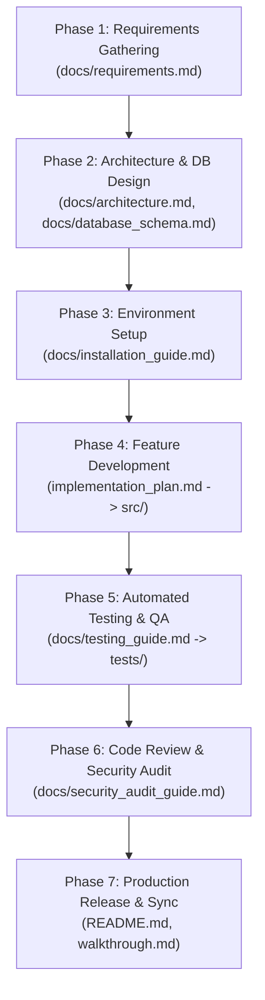

# 📘 Production-Grade Software Development Handbook (SDLC & Skill Guide)

คู่มือมาตรฐานการพัฒนาซอฟต์แวร์ระดับ Enterprise / Production-Grade สำหรับทีมพัฒนาและ AI Agent โดยรวบรวมแนวทางการทำงาน (Workflow), การออกแบบเอกสาร (`.md`), การใช้งาน AI Skills และ Quality Gates ในแต่ละขั้นตอนของการพัฒนาซอฟต์แวร์

---

## 🏗️ 1. Executive Principles & SDLC Overview

ระบบที่มีคุณภาพระดับ Production-Grade อาศัยระเบียบปฏิบัติที่เคร่งครัดตามหลักการดังนี้:

1. **Documentation-Driven Development**: เอกสารและ Specification ต้องสอดคล้องกับ Source Code เสมอ ไม่ปล่อยให้เอกสารล้าสมัย (Stale Docs)
2. **Strict Quality Gates**: งานในแต่ละ Phase จะผ่านไปยังขั้นต่อไปได้ ก็ต่อเมื่อผ่านเกณฑ์การทดสอบ (Quality Gate Criteria) ที่กำหนดไว้ครบถ้วน
3. **AI-Human Collaborative Workflow**: AI Agent และ Human Developer มีบทบาทหน้าที่และ Skill สอดรับกันทุกขั้นตอน
4. **Security & Resilience First**: ตรวจสอบช่องโหว่ความปลอดภัย ข้อมูลรั่วไหล และ Exception Handling ตั้งแต่ขั้นตอนการออกแบบและเขียนโค้ด

---

## 📍 2. SDLC Phases, Target Markdown Files & Skill Mapping

### Phase 1: Requirements Engineering & Reverse Engineering
* **เป้าหมาย:** สรุป Requirement ปัจจุบันจาก Source Code และกำหนดเพิ่มเติม Requirement ฟีเจอร์ใหม่แบบจัดหมวดหมู่
* **ไฟล์เอกสารหลัก:** [`docs/requirements.md`](requirements.md)
* **AI Skill ที่เกี่ยวข้อง:** `requirement-analyzer` / [`documentation-generator`](../.agents/skills/documentation-generator/SKILL.md)
* **กิจกรรมหลัก:**
  1. สแกน Business Logic และ Data Rules จาก Source Code ปัจจุบัน
  2. จัดกลุ่มเป็น Functional Requirements (FR), Non-Functional Requirements (NFR) และ Data Validation Rules
  3. เพิ่มเติม Requirement ฟีเจอร์ใหม่พร้อมกำกับสถานะ (เช่น `[Implemented]`, `[Planned]`)
* **Quality Gate:** เอกสาร Requirement ครอบคลุมภาพรวมระบบทั้งหมด และผ่านการสอบทานกับ Stakeholders/User

---

### Phase 2: Technical Design & Architecture
* **เป้าหมาย:** แปลง Requirement ให้เป็นสถาปัตยกรรมระบบ รูปแบบข้อมูล (Data Models) และ API Contracts
* **ไฟล์เอกสารหลัก:** 
  * [`docs/architecture.md`](architecture.md) (Component Flow & Pipeline Stages)
  * [`docs/database_schema.md`](database_schema.md) (ER Diagram & Table Specifications)
* **AI Skill ที่เกี่ยวข้อง:** [`documentation-generator`](../.agents/skills/documentation-generator/SKILL.md), [`python-enterprise-stack`](../.agents/skills/python-enterprise-stack/SKILL.md)
* **กิจกรรมหลัก:**
  1. เขียน Mermaid Diagrams แสดง Data Flow และ Component Interaction
  2. กำหนด Pydantic v2 Schemas สำหรับ Validation และ SQLAlchemy 2.0 ORM Models สำหรับ Database
  3. ระบุตารางและ Column Constraints (NOT NULL, Foreign Keys, Indexes)
* **Quality Gate:** Mermaid Diagrams สามารถ Render ได้ถูกต้อง และ Data Models สอดคล้องกับ Requirement ใน Phase 1

---

### Phase 3: Project Setup & Environment Configuration
* **เป้าหมาย:** กำหนดโครงสร้างโปรเจกต์ สภาพแวดล้อมที่จำเป็น และสคริปต์สำหรับการติดตั้งระบบ
* **ไฟล์เอกสารหลัก:** [`docs/installation_guide.md`](installation_guide.md)
* **AI Skill ที่เกี่ยวข้อง:** [`project-standardizer`](../.agents/skills/project-standardizer/SKILL.md)
* **กิจกรรมหลัก:**
  1. จัดโครงสร้าง Repository ตามมาตรฐาน Enterprise (`src/`, `tests/`, `configs/`, `docs/`)
  2. กำหนดไฟล์ `.env.example`, `requirements.txt` / `pyproject.toml` และ Git Hooks
  3. สร้าง 1-Click Setup Script (เช่น `setup_env.bat`)
* **Quality Gate:** สามารถรันการติดตั้งสภาพแวดล้อมผ่าน Script ได้โดยไม่มี Error บนเครื่องสะอาด (Clean Machine)

---

### Phase 4: Feature Implementation & Coding Standards
* **เป้าหมาย:** พัฒนาฟีเจอร์ตามแผนงาน โดยยึดหลัก Clean Architecture และ Enterprise Coding Standards
* **ไฟล์เอกสารหลัก:** `implementation_plan.md` *(จัดทำก่อนแก้ไขโค้ดทุกครั้ง)*
* **AI Skill ที่เกี่ยวข้อง:** [`python-enterprise-stack`](../.agents/skills/python-enterprise-stack/SKILL.md), [`refactoring-expert`](../.agents/skills/refactoring-expert/SKILL.md)
* **กิจกรรมหลัก:**
  1. นำเสนอ `implementation_plan.md` ให้ User อนุมัติก่อนเริ่มแตะไฟล์โค้ด
  2. เขียนโค้ดตามมาตรฐาน Python 3.10+ (Type Hinting, Docstrings ภาษาอังกฤษ, `snake_case`)
  3. นำระบบ Dual Logging (Loguru + SQLite Audit Log) และ Exception Handling มาใช้
* **Quality Gate:** โค้ดผ่านการคอมไพล์ ลินต์เตอร์ ไม่มีการฮาร์ดโค้ด Secrets และผ่านการอนุมัติ Implementation Plan

---

### Phase 5: Automated Testing & Quality Assurance
* **เป้าหมาย:** ทดสอบความถูกต้อง ยืนยันว่าฟีเจอร์ทำงานตรงตาม Requirement และไม่ทำให้ฟังก์ชันเดิมเสียหาย
* **ไฟล์เอกสารหลัก:**
  * [`docs/testing_guide.md`](testing_guide.md) (กลยุทธ์และคำสั่งการทดสอบ)
  * `walkthrough.md` (สรุปผลการทดสอบและผลการทำงาน)
* **AI Skill ที่เกี่ยวข้อง:** [`test-suite-generator`](../.agents/skills/test-suite-generator/SKILL.md), [`bug-fixer-debugger`](../.agents/skills/bug-fixer-debugger/SKILL.md)
* **กิจกรรมหลัก:**
  1. สร้าง Unit Tests & Integration Tests ด้วย `pytest`
  2. สร้าง Mock Data และ Edge Case Scenarios (เช่น ไฟล์เสีย, API Timeout, ข้อมูลไม่ครบ)
  3. หากพบ Test Failure ให้สกัด Root Cause Analysis (RCA) และแก้ไขที่ต้นเหตุ
* **Quality Gate:** Test Suite รันผ่าน 100% (Green) และครอบคลุม Critical Business Logic Pass Rate ตามเป้าหมาย

---

### Phase 6: Code Review & Security Audit
* **เป้าหมาย:** ตรวจสอบคุณภาพโค้ด ประสิทธิภาพ และความปลอดภัยตามมาตรฐานสากล
* **ไฟล์เอกสารหลัก:** [`docs/security_audit_guide.md`](security_audit_guide.md)
* **AI Skill ที่เกี่ยวข้อง:** [`code-reviewer`](../.agents/skills/code-reviewer/SKILL.md), [`security-auditor`](../.agents/skills/security-auditor/SKILL.md)
* **กิจกรรมหลัก:**
  1. ตรวจสอบช่องโหว่ OWASP Top 10, Secret Leaks, SQL Injection และ Insecure Dependencies
  2. รีวิว Code Smells, Performance Bottlenecks และ Design Pattern Violations
* **Quality Gate:** ไม่พบช่องโหว่ความปลอดภัยระดับ Critical/High และผ่านเกณฑ์ Code Review Checklist

---

### Phase 7: Release Management & Documentation Sync
* **เป้าหมาย:** สรุปผลการพัฒนา อัปเดตเอกสารระบบให้เป็นปัจจุบัน และพร้อมส่งมอบงาน
* **ไฟล์เอกสารหลัก:**
  * [`docs/development_guide.md`](development_guide.md) (คู่มือการพัฒนานี้)
  * [`README.md`](../README.md) (Landing Page ของโครงการ)
  * `walkthrough.md` (สรุปภาพรวมสิ่งที่ได้ดำเนินการแล้วเสร็จ)
* **AI Skill ที่เกี่ยวข้อง:** [`documentation-generator`](../.agents/skills/documentation-generator/SKILL.md)
* **กิจกรรมหลัก:**
  1. ตรวจสอบ ลิงก์ภายในเอกสารทั้งหมดเป็น Relative Links (`docs/...`)
  2. อัปเดต `README.md` ให้มี Quick Start และลิงก์ไปยังเอกสารทุกตัวใน `docs/`
* **Quality Gate:** เอกสารทุกฉบับซิงก์ตรงกับ Source Code เวอร์ชันล่าสุด 100%

---

## 📊 3. Master Summary Matrix

| Phase | Core Objective | Primary Markdown Document | Key AI Skill(s) |
| :--- | :--- | :--- | :--- |
| **1. Requirements** | Extract & Define Requirements | [`docs/requirements.md`](requirements.md) | `requirement-analyzer` [`documentation-generator`](../.agents/skills/documentation-generator/SKILL.md) |
| **2. Architecture** | System & Database Design | [`docs/architecture.md`](architecture.md) [`docs/database_schema.md`](database_schema.md) | [`documentation-generator`](../.agents/skills/documentation-generator/SKILL.md) [`python-enterprise-stack`](../.agents/skills/python-enterprise-stack/SKILL.md) |
| **3. Setup** | Env & Repository Standardization | [`docs/installation_guide.md`](installation_guide.md) | [`project-standardizer`](../.agents/skills/project-standardizer/SKILL.md) |
| **4. Implementation**| Feature Coding & Refactoring | `implementation_plan.md` *(`src/` directory)* | [`python-enterprise-stack`](../.agents/skills/python-enterprise-stack/SKILL.md) [`refactoring-expert`](../.agents/skills/refactoring-expert/SKILL.md) |
| **5. Testing** | Unit/Integration Tests & RCA | [`docs/testing_guide.md`](testing_guide.md) `walkthrough.md` | [`test-suite-generator`](../.agents/skills/test-suite-generator/SKILL.md) [`bug-fixer-debugger`](../.agents/skills/bug-fixer-debugger/SKILL.md) |
| **6. Security & Review**| Code Audit & Vulnerability Check | [`docs/security_audit_guide.md`](security_audit_guide.md) | [`code-reviewer`](../.agents/skills/code-reviewer/SKILL.md) [`security-auditor`](../.agents/skills/security-auditor/SKILL.md) |
| **7. Release** | Final Handover & Doc Sync | [`docs/development_guide.md`](development_guide.md) [`README.md`](../README.md) | [`documentation-generator`](../.agents/skills/documentation-generator/SKILL.md) |

---

## 🎯 4. Definition of Done (DoD) Checklist

ก่อนประกาศว่าฟีเจอร์หรือระบบเสร็จสมบูรณ์ระดับ Production-Grade ให้ตรวจสอบตาม Checklist ดังนี้:

- [ ] **Requirements:** มีการบันทึกใน [`docs/requirements.md`](requirements.md) และสอดคล้องกับพฤติกรรมของระบบ
- [ ] **Architecture:** มี Mermaid Diagram แสดง Data Flow และ DB Schema ใน `docs/`
- [ ] **Code Quality:** ไม่มีการสะกดผิด, คอมเมนต์ภาษาอังกฤษ, ไม่มี Hardcoded Secrets, ผ่าน Type Hints
- [ ] **Testing:** `pytest` รันผ่านทั้งหมด และมี Coverage ครอบคลุม Business Critical Paths
- [ ] **Security:** ผ่านการตรวจสอบช่องโหว่ความปลอดภัยระดับ Critical/High
- [ ] **Documentation:** อัปเดต `README.md` และเอกสารใน `docs/` ด้วย Relative Links ทั้งหมดเรียบร้อย

---

## 📝 5. Feature Backlogs & Developer Notes

### ✈️ UI Backlog (TODO List) - Airline Ticket Hold Concurrency Lock
เมื่อพร้อมนำระบบ Concurrency Lock ไปต่อเชื่อมกับหน้าจอ Streamlit UI ให้ปฏิบัติตาม Checklist ดังนี้:

- [ ] **1. Screen Entry Hook**: เมื่อคลิกเลือกเอกสารในหน้า Review & Verification ให้เรียก `acquire_document_lock(doc_id, current_user_id)` (ค่าเริ่มต้น TTL 15 นาที / 900 วินาที)
- [ ] **2. Timer Badge Component**: แสดง Badge นาฬิกานับถอยหลัง 15 นาทีที่มุมบนขวา (`⏱️ ถือครองสิทธิ์: MM:SS นาที`)
- [ ] **3. Conflict Warning Banner**: หากเอกสารถูกล็อกโดย User อื่น ให้ขึ้นแบนเนอร์สีเหลืองเตือน (`⚠️ เอกสารนี้กำลังตรวจโดย [user_id]`) และปิดฟอร์มแก้ไข (Disable inputs)
- [ ] **4. Extension Prompt Modal (Pop-up ต่อเวลา)**: เมื่อเวลาเหลือ < 1 นาที ให้แสดงหน้าต่างเตือนพร้อมปุ่ม `[✅ ยืนยันต่อเวลา 15 นาที]` ซึ่งจะยิงเรียก `renew_document_lock()`
- [ ] **5. Auto-Exit Handler**: เมื่อเวลานับถอยหลังถึง 0:00 และไม่มีการตอบรับ ให้เรียก `release_document_lock()` เคลียร์ Session และเปลี่ยนหน้ากลับไปที่ตารางคิวเอกสารส่วนกลางอัตโนมัติ
- [ ] **6. Navigation Exit Hook**: เมื่อผู้ใช้กดปุ่ม "ย้อนกลับ" หรือกด "Approve/Reject" ให้ปล่อย Lock คืนสู่ส่วนกลางอัตโนมัติ

