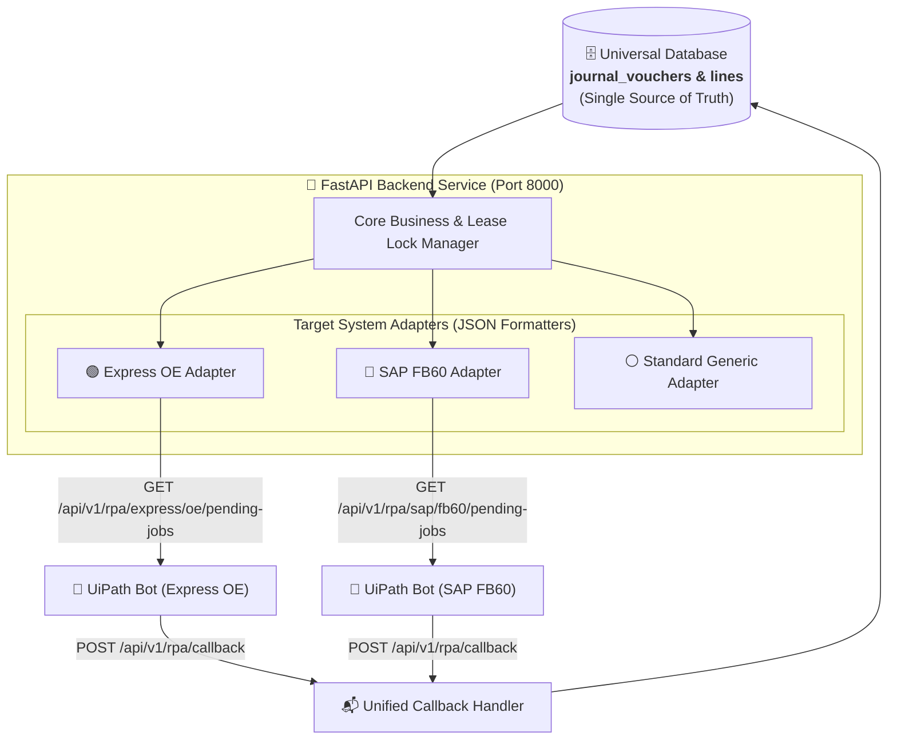

# 🚀 RPA API Development & Architecture Guide

> **Document Version**: 1.0.0  
> **Target Audience**: Backend Engineers, FastAPI Developers, RPA Engineers (UiPath), System Architects  
> **Status**: Approved Implementation Specification  

---

## 📌 1. Architecture Overview (Single Core + Adapter Pattern)

เพื่อรองรับการนำเข้าข้อมูลผ่าน RPA ไปยังระบบ ERP ที่หลากหลาย (เช่น **Express หน้าจอ OE** หรือ **SAP หน้าจอ FB60**) ระบบของเราใช้สถาปัตยกรรม **"Single Central Service + Adapter Pattern"** โดยมีฐานข้อมูลกลางเพียงชุดเดียว (`journal_vouchers`) แต่มีตัวแปลงรูปแบบ JSON (Adapters) แยกตามแต่ละระบบปลายทาง



---

## 🌐 2. RESTful Endpoint Hierarchy & Router Layout

โครงสร้างของ API แยก URL ตามแต่ละระบบปลายทางเพื่อให้ทีม RPA ใช้งานง่ายและ Swagger UI มีหมวดหมู่ชัดเจน:

| Method | Endpoint URL | คำอธิบาย | Target Consumer |
| :--- | :--- | :--- | :--- |
| `GET` | `/api/v1/rpa/express/oe/pending-jobs` | ดึงงานเอกสารในรูปแบบหน้าจอ Express OE | UiPath Express Bot |
| `GET` | `/api/v1/rpa/sap/fb60/pending-jobs` | ดึงงานเอกสารในรูปแบบหน้าจอ SAP FB60 | UiPath SAP Bot |
| `GET` | `/api/v1/rpa/standard/pending-jobs` | ดึงงานในรูปแบบ Universal Double-Entry | ERP Generic |
| `POST` | `/api/v1/rpa/callback` | ส่งผลลัพธ์การคีย์ (Success/Failure + Error Msg) | ทุก Bot ใช้ร่วมกัน |
| `POST` | `/api/v1/rpa/bot-status` | ส่ง Heartbeat และรายงานสถานะบอท (IDLE/BUSY) | ทุก Bot ใช้ร่วมกัน |

---

## 📄 3. Complete JSON Contracts

### 3.1 🟢 Express OE Format (`/api/v1/rpa/express/oe/pending-jobs`)
แบ่งเป็น 3 บล็อกย่อยตามการทำงานของบอท:
1. `oe_header`: กรอกหน้าจอหลัก OE
2. `oe_lines`: กรอกตารางรายการบัญชี
3. `withholding_tax`: กรอกหน้าต่างย่อย 50 ทวิ *(ถ้าไม่มีจะเป็น `null`)*

```json
{
  "status": "success",
  "data": {
    "document_id": "doc_grab_page_001",
    "has_wht": true,
    "oe_header": {
      "DepartmentCode": "",
      "DocumentNo": "OE260501002",
      "DocumentDate": "01/05/69",
      "CustomerCode": "G0001",
      "VatTypeId": 2,
      "RefBillNo": "20260501025541",
      "RefBillDate": "01/05/69",
      "FillingPeriod": "05/69",
      "TotalAmount": 1678.07,
      "VatAmount": 117.46,
      "EditVat": 1,
      "GrandTotal": 1795.53,
      "WithholdingTax": 1
    },
    "oe_lines": [
      {
        "DocumentLineNo": 1,
        "ItemCode": "95-5310-19",
        "Amount": 1678.07,
        "Description": "ค่าบริการดูแลรักษาระบบคอมพิวเตอร์"
      }
    ],
    "withholding_tax": {
      "WithholdingTaxNo": "26/05/002",
      "WhtDate": "01/05/69",
      "WhtFormType": "ภ.ง.ด.53",
      "IncomeType": "ค่าบริการ/ค่าจ้างทำของ",
      "WhtRate": 3.0,
      "BaseAmount": 1678.07,
      "TaxAmount": 50.34,
      "Condition": 1
    }
  }
}
```

---

### 3.2 🔵 SAP FB60 Format (`/api/v1/rpa/sap/fb60/pending-jobs`)
จัดรูปแบบตามมาตรฐาน Header & Items ของ SAP:

```json
{
  "status": "success",
  "data": {
    "document_id": "doc_grab_page_001",
    "header": {
      "CompanyCode": "1000",
      "DocumentType": "KR",
      "DocDate": "2026-05-01",
      "PostingDate": "2026-05-01",
      "Currency": "THB",
      "Reference": "OE260501002",
      "DocHeaderText": "Grab Service Exp",
      "VendorNumber": "0001055001"
    },
    "items": [
      {
        "PostingKey": "40",
        "GLAccount": "0052601000",
        "Amount": 1678.07,
        "TaxCode": "V7",
        "CostCenter": "CC1001",
        "ItemText": "Grab Transport Exp"
      }
    ]
  }
}
```

---

### 3.3 📬 Unified Callback Contract (`POST /api/v1/rpa/callback`)

#### Request Payload (กรณีสำเร็จ - Success):
```json
{
  "document_id": "doc_grab_page_001",
  "target_system": "express_oe",
  "rpa_status": "SUCCESS",
  "erp_voucher_no": "OE260501002",
  "executed_by": "UiPath_Bot_01",
  "executed_at": "2026-08-29T15:00:00Z",
  "error_message": null
}
```

#### Request Payload (กรณีล้มเหลว - Failure / Error):
```json
{
  "document_id": "doc_grab_page_001",
  "target_system": "express_oe",
  "rpa_status": "FAILED",
  "erp_voucher_no": null,
  "executed_by": "UiPath_Bot_01",
  "executed_at": "2026-08-29T15:00:15Z",
  "error_message": "BusinessException: รหัสผังบัญชี 95-5310-19 ถูกระงับการใช้งานในผังบัญชี"
}
```

---

## 🗄️ 4. Universal Database Schema & SQL Specifications

```sql
-- 4.1 ตารางหัวใบสำคัญ (Universal Header + Extensions)
CREATE TABLE journal_vouchers (
    voucher_id VARCHAR(36) PRIMARY KEY,               -- UUID
    document_id VARCHAR(100) NOT NULL UNIQUE,        -- 1:1 กับ document_controls
    company_id VARCHAR(36) NOT NULL,
    batch_id VARCHAR(100) NOT NULL,
    
    -- Universal Financial Fields
    voucher_type VARCHAR(20) NOT NULL DEFAULT 'PV',  -- 'PV', 'AP', 'JV', 'RV'
    voucher_no VARCHAR(100) NOT NULL UNIQUE,         -- เลขที่ระบบ Gen ให้ (เช่น OE260501002)
    voucher_date VARCHAR(50) NOT NULL,               -- วันที่ลงบัญชี (เช่น '01/05/69' หรือ '2026-05-01')
    description TEXT,
    
    vendor_code VARCHAR(50),                         -- CustomerCode / Vendor Number (เช่น G0001)
    vendor_name VARCHAR(200),
    vendor_tax_id VARCHAR(50),
    
    ref_doc_no VARCHAR(100),                         -- RefBillNo
    ref_doc_date VARCHAR(50),                        -- RefBillDate
    
    subtotal_amount FLOAT NOT NULL,                  -- TotalAmount
    vat_amount FLOAT DEFAULT 0.0,                    -- VatAmount
    net_amount FLOAT NOT NULL,                       -- GrandTotal
    wht_amount FLOAT DEFAULT 0.0,
    
    -- Express OE Specific Extensions
    department_code VARCHAR(50) DEFAULT '',          -- DepartmentCode
    vat_type_id INTEGER DEFAULT 2,                   -- VatTypeId (2 = แยกนอก)
    filing_period VARCHAR(20),                       -- FillingPeriod (เช่น '05/69')
    edit_vat INTEGER DEFAULT 1,                      -- EditVat (1 = อนุญาตแก้ไข)
    withholding_tax_no VARCHAR(50) DEFAULT '',       -- WithholdingTaxNo (เช่น '26/05/002')
    
    -- Concurrency Lease & Status
    status_code VARCHAR(50) DEFAULT 'READY_FOR_RPA', -- 'READY_FOR_RPA', 'RPA_PROCESSING', 'ERP_POSTED', 'RPA_ERROR'
    is_locked INTEGER DEFAULT 0,
    locked_by VARCHAR(50),
    locked_at VARCHAR(50),
    erp_reference_no VARCHAR(100),
    rpa_error_reason TEXT,
    
    created_at VARCHAR(50) NOT NULL,
    updated_at VARCHAR(50),
    
    FOREIGN KEY (document_id) REFERENCES document_controls(document_id) ON DELETE CASCADE
);

-- 4.2 ตารางรายการบัญชี (Universal Line Items)
CREATE TABLE journal_voucher_lines (
    line_id VARCHAR(36) PRIMARY KEY,
    voucher_id VARCHAR(36) NOT NULL,
    line_number INTEGER NOT NULL,                    -- DocumentLineNo
    
    entry_type VARCHAR(10) NOT NULL,                 -- 'DEBIT' / 'CREDIT'
    account_code VARCHAR(50) NOT NULL,               -- ItemCode (เช่น '95-5310-19')
    account_name VARCHAR(150),
    amount FLOAT NOT NULL,                           -- Amount
    department_code VARCHAR(50) DEFAULT '',
    description TEXT,
    
    FOREIGN KEY (voucher_id) REFERENCES journal_vouchers(voucher_id) ON DELETE CASCADE
);
```

---

## 🔒 5. Concurrency Lock & Lease Timeout Engine

เพื่อป้องกันไม่ให้บอทหลายตัวแย่งบิลใบเดียวกัน หรือเกิด Deadlock เมื่อเครื่องดับ:

```python
# ตัวอย่างโค้ด Lock Lease ใน FastAPI Service
from datetime import datetime, timedelta, timezone
from sqlalchemy import select
from sqlalchemy.orm import Session

LEASE_TIMEOUT_MINUTES = 15

def get_and_lock_next_voucher(db: Session, bot_id: str, target_system: str):
    now = datetime.now(timezone.utc)
    timeout_threshold = (now - timedelta(minutes=LEASE_TIMEOUT_MINUTES)).isoformat()
    
    # 1. ปลด Lock เอกสารที่ค้างเกิน Timeout (Auto Recovery)
    stale_stmt = (
        select(JournalVoucher)
        .where(
            JournalVoucher.status_code == "RPA_PROCESSING",
            JournalVoucher.is_locked == 1,
            JournalVoucher.locked_at < timeout_threshold
        )
    )
    stale_vouchers = db.scalars(stale_stmt).all()
    for v in stale_vouchers:
        v.is_locked = 0
        v.locked_by = None
        v.status_code = "READY_FOR_RPA"
    
    # 2. ค้นหาเอกสารพร้อมทำ และ Lock แบบ Atomic
    stmt = (
        select(JournalVoucher)
        .where(
            JournalVoucher.status_code == "READY_FOR_RPA",
            JournalVoucher.is_locked == 0
        )
        .with_for_update(skip_locked=True)
        .limit(1)
    )
    voucher = db.scalars(stmt).first()
    
    if voucher:
        voucher.is_locked = 1
        voucher.locked_by = bot_id
        voucher.locked_at = now.isoformat()
        voucher.status_code = "RPA_PROCESSING"
        db.commit()
        db.refresh(voucher)
        
    return voucher
```

---

## 🛠️ 6. Backend Directory Structure in FastAPI

```text
src/
├── domain/
│   └── models/
│       ├── journal_voucher.py
│       └── account_mapping.py
├── infrastructure/
│   ├── persistence/
│   │   └── models.py
│   └── adapters/
│       ├── express_oe_adapter.py      # แปลง Voucher Model เป็น JSON Express OE
│       └── sap_fb60_adapter.py        # แปลง Voucher Model เป็น JSON SAP FB60
└── interfaces/
    └── api/
        └── rpa/
            ├── express_router.py      # /api/v1/rpa/express/...
            ├── sap_router.py          # /api/v1/rpa/sap/...
            ├── callback_router.py     # /api/v1/rpa/callback
            └── bot_status_router.py   # /api/v1/rpa/bot-status
```
