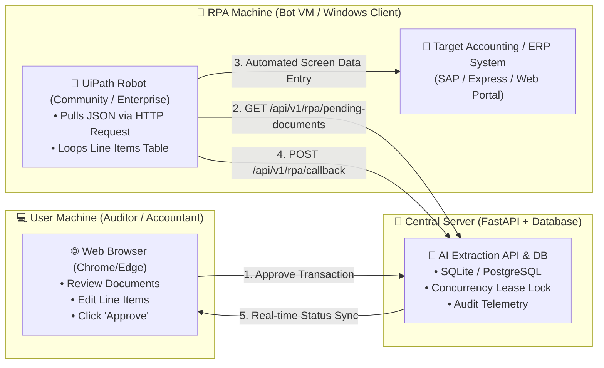
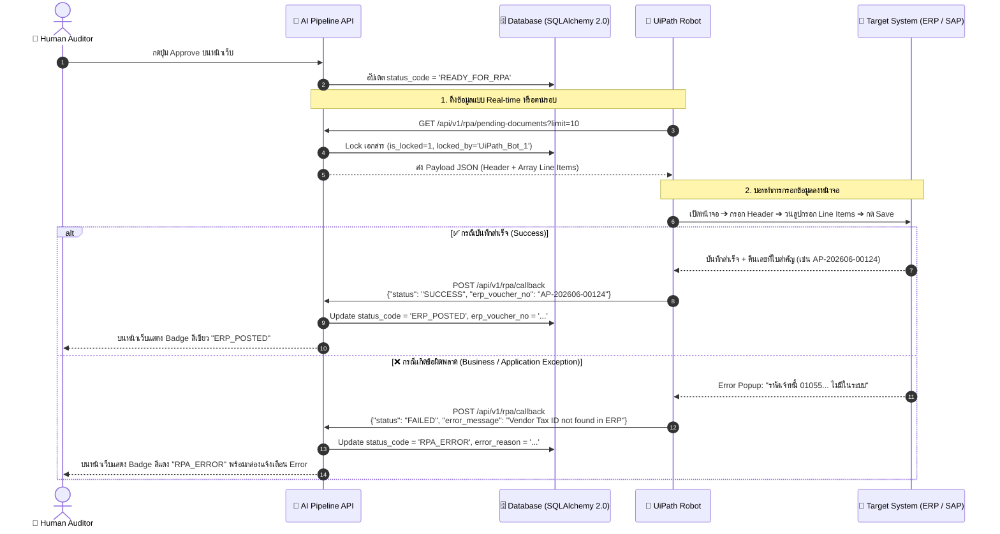
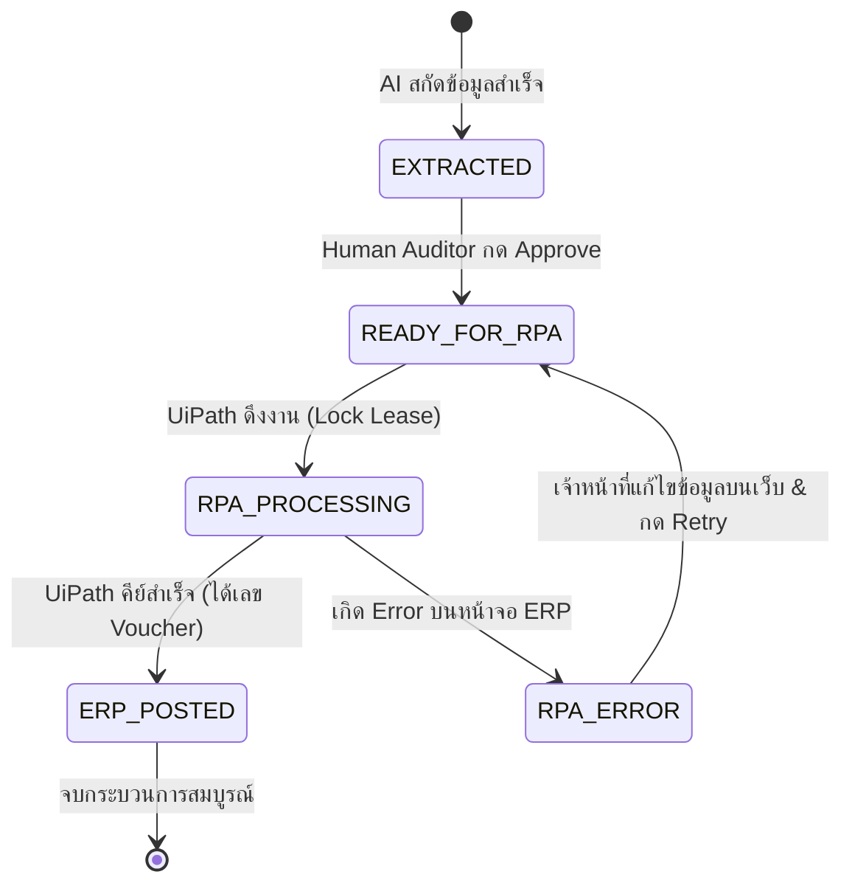

# 🤖 RPA (UiPath) Integration Architecture & Solution Design

> **Document Version**: 1.0.0  
> **Target Audience**: AI Developers, RPA Engineers, Solution Architects, Business Analysts  
> **Status**: Approved Blueprint for Implementation  

---

## 📌 1. Executive Summary & Overview

เอกสารนี้ระบุ **พิมพ์เขียวการเชื่อมต่อ (Integration Blueprint)** ระหว่าง **AI Multi-Docs Extraction Pipeline** กับ **UiPath (Robotic Process Automation - RPA)** เพื่อทำหน้าที่นำเข้าข้อมูลเอกสารที่ผ่านการตรวจสอบแล้ว (Validated & Approved Transactions) เข้าสู่ระบบบัญชี/ERP ปลายทาง (เช่น SAP, Express, Oracle, หรือ Web ERP) โดยอัตโนมัติ

### 🌟 Key Design Principles:
1. **Direct JSON via REST API (Zero File Overhead)**: ไม่ต้อง Export เป็นไฟล์ Excel/CSV ให้เกิดภาระจัดเก็บ ข้อมูลวิ่งผ่าน API แบบ Real-time
2. **Two-Way Feedback Callback Loop**: มีช่องทางให้ UiPath แจ้งผลลัพธ์กลับมาทันที (สำเร็จได้เลข Voucher / ล้มเหลวได้ Error Message กลับมาแสดงบน Web UI)
3. **Multi-Machine Separation (Clean Topology)**: แยกเครื่อง User ที่ตรวจเอกสารบน Web Browser ออกจากเครื่อง Bot VM ที่รัน UiPath เพื่อไม่ให้แย่ง Mouse/Keyboard กัน
4. **100% UiPath Community Edition (Free) Compatible**: รองรับทั้ง UiPath Free และ UiPath Enterprise Orchestrator

---

## 🌐 2. Multi-Machine Deployment Topology



---

## 🔄 3. End-to-End Sequence Flow



---

## 📡 4. REST API Specifications

### 4.1 `GET /api/v1/rpa/pending-documents`
ใช้สำหรับให้ UiPath ยิงมาดึงรายการเอกสารที่พร้อมคีย์ลงระบบ

* **Method**: `GET`
* **Query Parameters**:
  * `doc_type` (string, optional): เช่น `expense_receipt`, `tax_invoice`
  * `company_id` (string, optional): รหัสบริษัท
  * `limit` (integer, default: `10`): จำนวนเอกสารสูงสุดต่อรอบ

#### 📥 Example Response Payload (`200 OK`):
```json
{
  "status": "success",
  "total_count": 1,
  "data": [
    {
      "document_id": "doc_grab_page_001",
      "batch_id": "batch_e2e_grab_001",
      "doc_type_id": "expense_receipt",
      "doc_number": "GB-202606-0001",
      "doc_date": "2026-06-15",
      "merchant_name": "Grab Taxi (Thailand) Co., Ltd.",
      "merchant_tax_id": "0105556091219",
      "merchant_short_name": "GRAB",
      "expense_category": "Travel & Transportation",
      "payment_method": "Credit Card",
      "subtotal": 120.00,
      "vat_amount": 8.40,
      "net_amount": 128.40,
      "items": [
        {
          "item_id": "item_001_1",
          "item_name": "GrabTransport Ride Service (Siam -> Asok)",
          "quantity": 1,
          "unit_price": 120.00,
          "amount": 120.00
        }
      ]
    }
  ]
}
```

---

### 4.2 `POST /api/v1/rpa/callback`
ใช้สำหรับให้ UiPath ยิงกลับมารายงานผลการคีย์ข้อมูล (Success หรือ Error)

* **Method**: `POST`
* **Content-Type**: `application/json`

#### 📤 Example Request Payload (Success):
```json
{
  "document_id": "doc_grab_page_001",
  "rpa_status": "SUCCESS",
  "erp_voucher_no": "AP-6906-00124",
  "executed_by": "UiPath_Bot_01",
  "executed_at": "2026-08-29T12:30:00Z",
  "error_message": null
}
```

#### 📤 Example Request Payload (Failure / Exception):
```json
{
  "document_id": "doc_grab_page_002",
  "rpa_status": "FAILED",
  "erp_voucher_no": null,
  "executed_by": "UiPath_Bot_01",
  "executed_at": "2026-08-29T12:30:15Z",
  "error_message": "BusinessException: ยอดเงินเกินงบประมาณที่กำหนดสำหรับหมวด Food & Beverage"
}
```

#### 📥 Example Response Payload (`200 OK`):
```json
{
  "status": "success",
  "message": "Document doc_grab_page_001 updated to ERP_POSTED successfully."
}
```

---

## 🗄️ 5. Database Schema & State Transitions

### 5.1 ตารางสถานะของเอกสาร (Document State Lifecycle)



### 5.2 การปรับปรุง Schema ใน `document_controls`

| Column Name | Data Type | Default | คำอธิบาย |
| :--- | :--- | :--- | :--- |
| `rpa_status` | `VARCHAR(50)` | `'PENDING'` | สถานะ RPA (`PENDING`, `PROCESSING`, `SUCCESS`, `FAILED`, `RETRY`) |
| `erp_voucher_no` | `VARCHAR(100)` | `NULL` | เลขที่ใบสำคัญหรือเลขที่เอกสารที่ออกโดยระบบ ERP |
| `rpa_error_reason` | `TEXT` | `NULL` | ข้อความ Error ชัดเจนที่ Bot ดึงมาจากหน้าจอ |
| `rpa_executed_at` | `VARCHAR(50)` | `NULL` | วันเวลาที่ Bot ประมวลผลเสร็จสิ้น (ISO 8601) |

---

## 🛠️ 6. UiPath Implementation Guidelines (Community / Free Edition)

### 6.1 Required Packages (Free 100%):
1. **`UiPath.WebAPI.Activities`**:
   - `HTTP Request`: สำหรับยิง GET ดึงข้อมูล และ POST ส่งผลลัพธ์
   - `Deserialize JSON` / `Deserialize JSON Array`: แปลง Response String เป็น `JObject` / `JArray`
2. **`UiPath.UIAutomation.Activities`**:
   - `Use Application/Browser`, `Type Into`, `Click`, `Check App State`
3. **`UiPath.System.Activities`**:
   - `Try Catch`, `If`, `For Each`, `Assign`, `Log Message`

### 6.2 ตัวอย่างโค้ด Expression ใน UiPath:
* ดึงเลขที่เอกสาร: `jsonDoc("doc_number").ToString`
* ดึง Tax ID: `jsonDoc("merchant_tax_id").ToString`
* ดึงยอดสุทธิ: `CDbl(jsonDoc("net_amount").ToString)`
* วนลูปตารางสินค้า: `For Each item In JArray.Parse(jsonDoc("items").ToString)`
  * ชื่อสินค้า: `item("item_name").ToString`
  * จำนวน: `CInt(item("quantity").ToString)`
  * ราคา: `CDbl(item("unit_price").ToString)`

---

## 🚀 7. Roadmap & Next Steps for Implementation

1. **Step 1 (FastAPI Endpoints)**:
   - สร้าง Router `src/interfaces/api/rpa_router.py` เพื่อเปิด 2 เส้นทาง API (`/pending-documents` และ `/callback`)
2. **Step 2 (Database Migration)**:
   - เพิ่มคอลัมน์ `rpa_status`, `erp_voucher_no`, `rpa_error_reason`, `rpa_executed_at` ใน `models.py`
3. **Step 3 (UiPath Starter Template)**:
   - สร้าง Workflow XAML ตัวอย่าง (`RPA_Dispatcher.xaml` และ `RPA_Performer.xaml`)
4. **Step 4 (Web UI Integration)**:
   - เพิ่ม Badge `ERP_POSTED` / `RPA_ERROR` และปุ่ม `Retry RPA` ในหน้าจอ Document Audit
