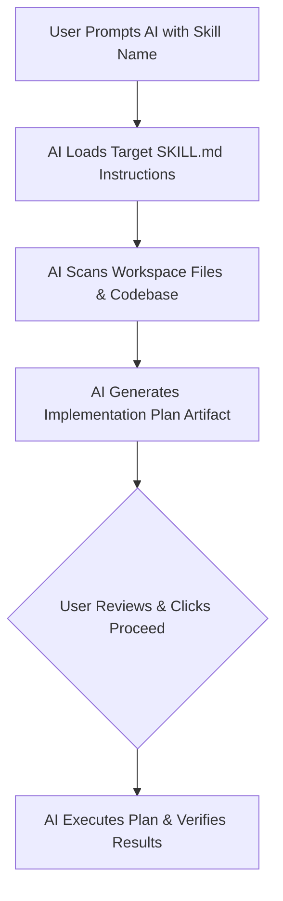

# 🧰 AI Skill Kit: User & Developer Guide

This guide explains how to use the **8 Workspace Skills** configured in `.agents/skills/`. These skills empower developers and AI Agents to collaborate efficiently across the entire Software Development Lifecycle (SDLC).

---

## 📋 Overview of All 8 Workspace Skills

| Skill Name | Location | Primary Purpose | When to Use |
| :--- | :--- | :--- | :--- |
| **`python-enterprise-stack`** | [`.agents/skills/python-enterprise-stack/`](../.agents/skills/python-enterprise-stack/SKILL.md) | Enterprise Python 3.10+ standards, SQLAlchemy 2.0 ORM patterns, Dual Logging (Loguru + SQLite DB), Pydantic v2, Streamlit, and PyMuPDF. | Primary reference for Python architecture, DB modeling, and logging. |
| **`project-standardizer`** | [`.agents/skills/project-standardizer/`](../.agents/skills/project-standardizer/SKILL.md) | Standardizes folder layout, setup scripts (`setup_env.py`), `.gitignore`, and `.githooks`. | Project bootstrap & periodic repo health checks. |
| **`documentation-generator`** | [`.agents/skills/documentation-generator/`](../.agents/skills/documentation-generator/SKILL.md) | Scans codebase modules and DB schemas to generate/update `docs/` (`architecture.md`, `database_schema.md`, `README.md`). | After adding major features or modifying database schema. |
| **`code-reviewer`** | [`.agents/skills/code-reviewer/`](../.agents/skills/code-reviewer/SKILL.md) | Performs multi-dimensional code quality, ORM pattern, logic bug, and style audit (auto-references `python-enterprise-stack`). | Before committing or merging new code changes. |
| **`test-suite-generator`** | [`.agents/skills/test-suite-generator/`](../.agents/skills/test-suite-generator/SKILL.md) | Scans `src/` modules and writes comprehensive unit/integration tests into `tests/`. | When adding new features or increasing test coverage. |
| **`bug-fixer-debugger`** | [`.agents/skills/bug-fixer-debugger/`](../.agents/skills/bug-fixer-debugger/SKILL.md) | Analyzes error stack traces and logs to perform root cause analysis and surgical bug fixes. | When encountering runtime errors, crashes, or test failures. |
| **`refactoring-expert`** | [`.agents/skills/refactoring-expert/`](../.agents/skills/refactoring-expert/SKILL.md) | Cleans up legacy code, enforces DRY principle, and optimizes performance without changing behavior. | When cleaning up complex functions or optimizing bottlenecks. |
| **`security-auditor`** | [`.agents/skills/security-auditor/`](../.agents/skills/security-auditor/SKILL.md) | Audits code for secret leaks, SQL injection, insecure dependencies, and OWASP risks. | Before releasing to production or security reviews. |

---

## 💬 How to Invoke Skills in Chat (Sample Prompts)

Antigravity IDE automatically discovers all skills under `.agents/skills/`. You can invoke any skill simply by asking the AI in natural language (Thai or English):

### 1. `python-enterprise-stack`
> **Thai**: `ขอปรับโครงสร้าง DB และ Logging ให้ตรงตาม skill python-enterprise-stack`  
> **English**: `Refactor database layer and logging to comply with skill python-enterprise-stack.`

### 2. `code-reviewer`
> **Thai**: `ช่วยรีวิวโค้ดใน src/infrastructure/database/repositories/document_repo.py ตาม skill code-reviewer ให้หน่อย`  
> **English**: `Review code in src/infrastructure/database/repositories/document_repo.py using skill code-reviewer.`

### 3. `project-standardizer`
> **Thai**: `ช่วยสแกนและจัดโครงสร้างโปรเจกต์นี้ตาม skill project-standardizer ให้หน่อย`  
> **English**: `Please audit and standardize the repository layout using skill project-standardizer.`

### 4. `documentation-generator`
> **Thai**: `ช่วยตรวจและอัปเดตเอกสารใน docs ตาม skill documentation-generator ให้หน่อย`  
> **English**: `Update project documentation in docs/ according to skill documentation-generator.`

### 5. `test-suite-generator`
> **Thai**: `ช่วยเขียน unit test ให้กับ src/domain/services/template_evaluator.py ตาม skill test-suite-generator`  
> **English**: `Generate unit tests for src/domain/services/template_evaluator.py using skill test-suite-generator.`

### 6. `bug-fixer-debugger`
> **Thai**: `เกิด Error นี้ [แปะ Log] ช่วยวิเคราะห์และแก้ไขตาม skill bug-fixer-debugger ให้หน่อย`  
> **English**: `Analyze this error stack trace and fix it using skill bug-fixer-debugger.`

### 7. `refactoring-expert`
> **Thai**: `ช่วยปรับโค้ดใน src/infrastructure/database/engine.py ให้สะอาดขึ้นตาม skill refactoring-expert`  
> **English**: `Refactor src/infrastructure/database/engine.py for better performance using skill refactoring-expert.`

### 8. `security-auditor`
> **Thai**: `ช่วยสแกนความปลอดภัยของโปรเจกต์ตาม skill security-auditor ให้หน่อย`  
> **English**: `Perform a security vulnerability audit using skill security-auditor.`

---

## 🔄 Standard AI Execution Flow

All skills follow this strict governance flow to ensure full transparency, code safety, and user control.
